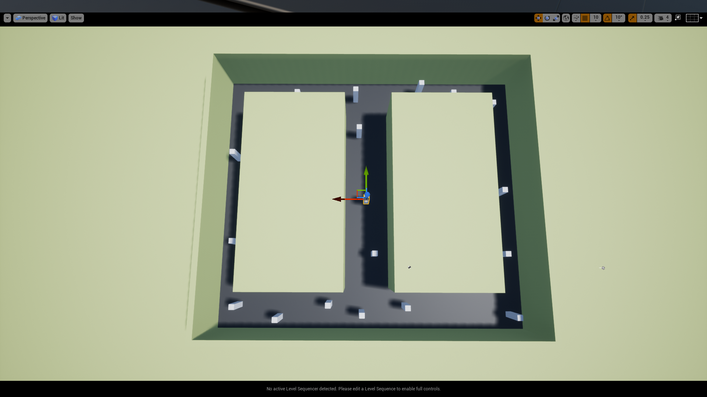

# UAV indoor obstacle avoidance based on AI technique 

## Paper

Implementation of paper: [An approach for UAV indoor obstacle avoidance based on AI technique with ensemble of ResNet8 and Res-DQN](https://ieeexplore.ieee.org/document/9023811)

## Overview
A new control model which helps quad-copter to automatically find path and avoid obstacles indoor is introduced. The challenge of this model for quad-copter is the complex indoor environments with obstacles. Base on Deep Reinforcement Learning and Deep Learning platform, state of the art algorithms in Artificial Intelligence (AI), a new Ensemble model is proposed. The proposed model uses two algorithms to control quad-copter. One is quad-copter path finding algorithm (Deep Learning - ResNet8) and the other algorithm (Deep Reinforcement Learning - Res-DQN) dealing with obstacle avoidance. The output of both two algorithms are combined to change the direction of quad-copter adaptively with indoor environments. The simulation results have been assessed to verify the numerous performance of proposed control model.

## Ensemble Model
  The idea of ensemble is to combine the outputs of the two models in the most efficient way. ResNet8 with outputs are the probability for each action, Res-DQN outputs are the accumulative reward for each action.
 

  

## Datasets
  In order for the drone to learn the control commands from the images, we use an emulator called Airsim and create our own dataset. Initially, we used Airsim to create a simulation environment in the form of narrow corridors with numerous column obstacles. The drone is controlled by a pilot with three control commands corresponding to three labels: Go straight; Turn left; Turn right. Then, 1000 images were collected to form the dataset. Because a dataset of 1018 images is not sufficient for the Deep Learning algorithms to work properly, we use data augmentation techniques to increase the dataset size to 11,000 images. 

## Training
  Input: The input image is an RGB image with dimensions of 144x256x3. Then they are about the size 72x128x3 resize to fit the requirements of the network input ResNet 8. 

  Training: We divide the dataset into a train set and a validation set at an 8: 2 ratio. The model compiled with loss function is categorical crossentropy, optimizer is Adam and metrics is Accuracy. We set the checkpoint to save the model with the smallest loss function on the validation set after each epoch. We then train the model with batch size = 256 and number of epochs = 50. To compare the effectiveness of the model, we conduct dataset training on two models, ResNet 8 and VGG 16. The results are shown in the change of the value of the accuracy as follows: 

  

## Running the code

This code has been tested on Ubuntu 16.04, Unreal Engine 4 18.23 and on Python 3.7.4.

* Airsim 1.2.4
* TensorFlow 1.14.0
* Keras 2.2.4 (Make sure that the Keras version is correct!)
* NumPy 1.18.1
* OpenCV 4.1.0.25

## Demo

Video demo: [link](https://youtu.be/7WMC5723dsE)
## Contact

Quan Tran Hai : [Linkedin](www.linkedin.com/in/haiquantran-drone)
